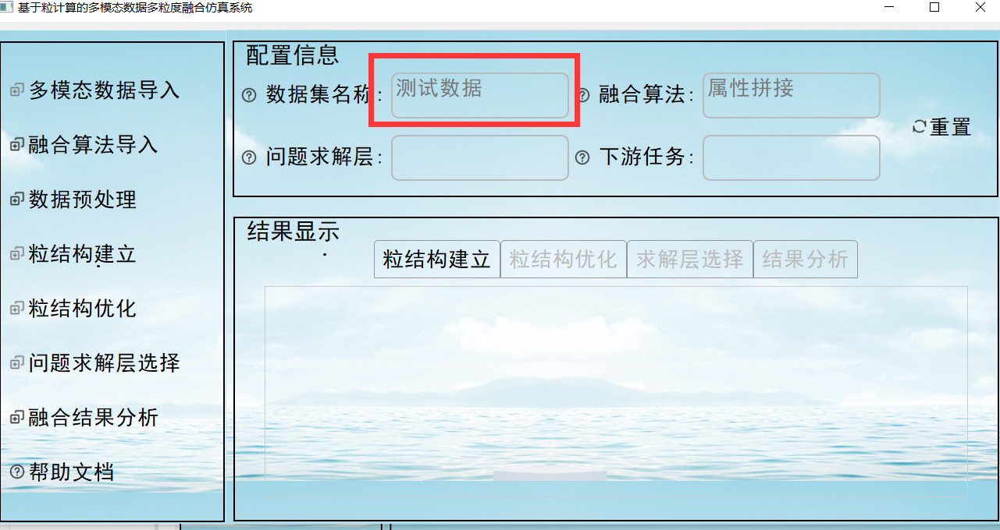
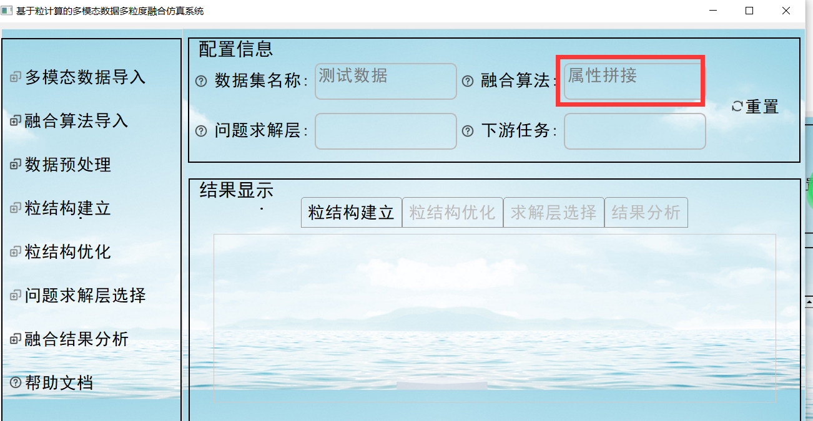
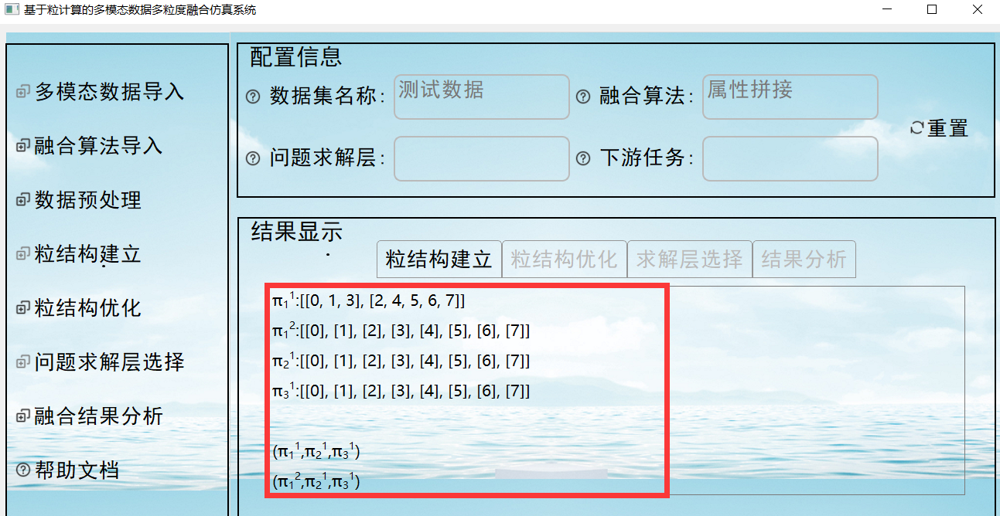
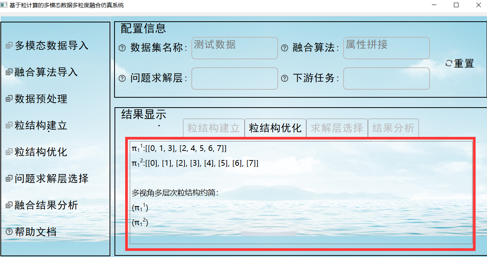
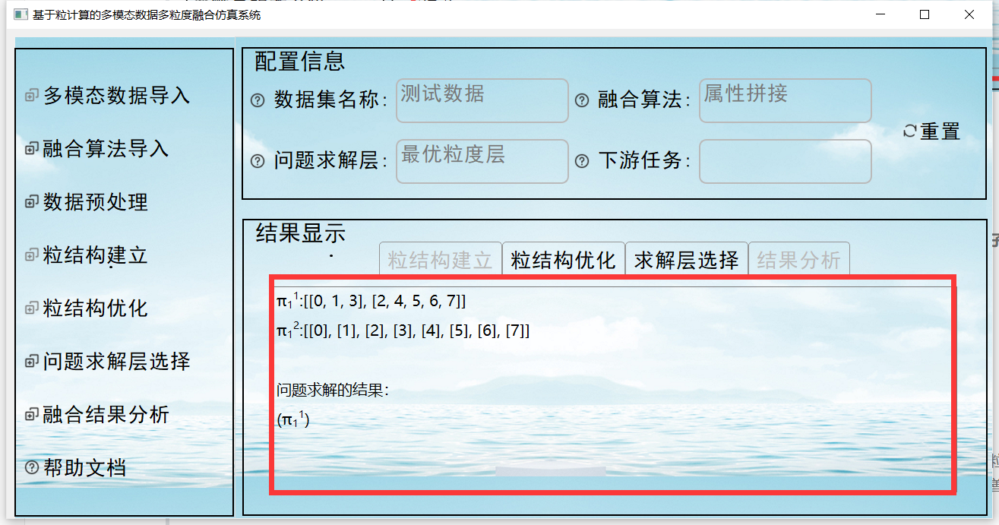
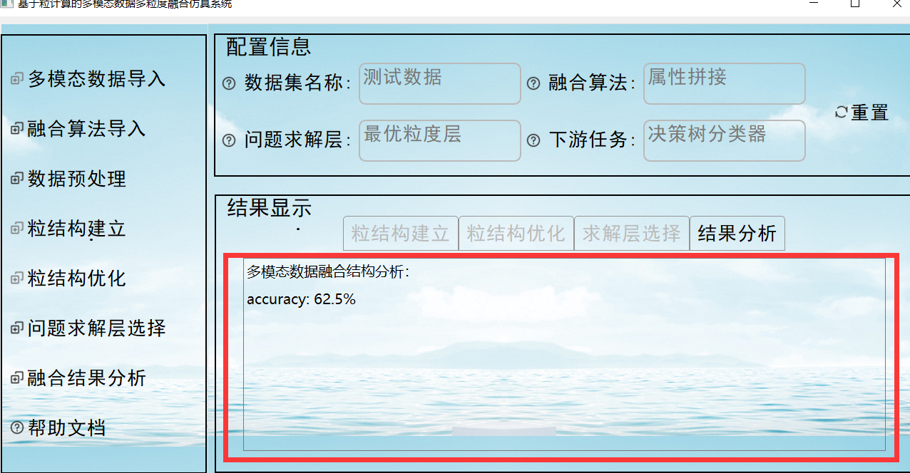

# 基于粒计算的多模态多粒度融合仿真系统使用说明 `v1.3`

## 1.  主界面（系统首页）

>
>
>由上图可知，主界面清晰地划分为三个主要区域，以满足功能模块化、配置信息展示和结果输出的需求。具体描述如下：左侧区域主要用于功能模块的导航与操作，是整个系统的核心控制部分，包括多模态数据导入、融合算法导入、数据预处理、粒结构建立、粒结构优化、问题求解层选择、融合结果分析、帮助文档八个部分组成。 右侧上部：配置信息模块，此区域用于显示和调整当前任务或模块的配置信息，便于用户了解系统状态并实时修改相关参数。右侧下部：结果显示模块，该区域专注于功能执行后的结果展示，支持多种可视化形式，直观呈现分析结果，帮助用户快速理解输出内容。

## 2. 系统使用流程

### 2.1  多模态数据导入

>
>
>多模态数据导入主要是将我们要处理的数据集进行导入，**目前仅支持`.csv`格式的数据进行导入**，导入的结果会呈现在配置信息中的数据名称中，具体实现效果如下：
>
>

### 2.2  融合算法导入

>
>
>融合算法导入主要是实现已有多模态数据融合算法的导入，供问题求解模块调用。**目前该系统支持三种融合算法的导入：属性拼接、结果融合、特征融合**，选择界面如下（**如果不进行选择，默认情况下为属性拼接**）：
>
>
>
>选择好的融合算法，会在主界面的配置信息中的融合算法后显示，具体实现效果如下：
>
>

### 2.3 数据预处理

>
>
>数据预处理模块对导入的多模态数据进行处理，生成标准化格式的数据，为系统构建粒结构提供基础支持。该模块主要将导入的数据按照视图和层次进行划分，以便粒结构的建立。主要有以下三个功能点：
>
>* **支持自定义视图大小：** 用户可灵活调整数据集视图的尺寸，满足不同分析需求。
>* **支持自定义层次大小：** 用户可自由选择层次划分的范围，优化数据分层结构。
>* **支持分类划分（离散化）：** 将指定范围内的值归为同一类别，进一步明确层次划分标准。
>
>通过这些功能，数据预处理模块确保数据格式的规范性与灵活性，为后续粒结构的构建和优化奠定了坚实基础。具体数据预处理配置模块如下：
>
>
>
>**视图划分规则（自定义视图大小）**
>
>
>
>>根据属性数量的判断，可对视图进行划分。划分时以英文字符 `,` 作为视图间的分隔符，实现多视图的有效划分。具体效果如下：
>
>>
>
>>注： 以上图为例，我们可以看到有6个判断属性，我们将其划分了3个视图，每个视图有2个判断属性。
>
>**层次划分规则（自定义层次大小）**
>
>
>
>>基于已划分的视图，可对判断属性进一步进行层次划分。划分时，以英文字符 `,` 分隔视图内不同层次的判断属性，并以换行符 `\n` 作为视图间的分隔边界。具体效果如下：
>
>>
>
>>注：以上图为例，可以看到共有三个视图。其中，第一个视图的两个判断属性被划分为两个层次；第二个视图的两个判断属性被划分为同一层次；第三个视图的两个判断属性也被划分为同一层次。
>
>**分类划分（离散化）规则**
>
>
>
>>**离散化处理采用文件导入的方式进行规则指定，目前仅支持导入 `.txt` 文件**。在该文件中，使用 `|` 分隔相同判断属性下的不同分类规则，换行符 `\n` 用于分隔不同的层次，虚线 `----` 表示不同视图的边界，而 `-` 用于表示划分范围。具体配置文件格式如下：
>
>>
>
>>注：以上图为例，文件中包含两个 `----`，说明数据被划分为三个视图。在第一个视图中有一个层次划分，第二个视图中有两个层次划分，第三个视图中也有两个层次划分，对应的数据处理形式为：`2\n 1,1 \n 1,1`。以第一个视图中的层次为例，第一个判断属性的值为 `0` 时，第二个判断属性中 `0-89` 范围的数值归为一类。同样，第一个判断属性的值为 `1` 时，第二个判断属性中 `0-89` 范围的数值也归为一类。通过这种方式，实现了数据的离散化处理。

### 2.4 粒结构建立

>
>
>粒结构建立模块用于实现多模态数据的粒结构构建，生成初始的多模态数据粒结构，并为粒结构优化模块提供输入。该模块主要由三个子模块组成：多视角构建子模块、多层次粒结构构建子模块，以及多视角多层次粒结构构建子模块。经过数据预处理后的数据将用于粒结构的构建，并在结果显示界面的粒结构建立模块中呈现已构建的粒结构。具体效果如下：
>
>
>
>

### 2.5 粒结构优化

>
>
>粒结构优化模块实现多模态数据粒结构的优 化，输出优化的多模态数据粒结构，为问题求解模块提供输入，即问题求解空间， 主要包括三个子模块：多视角约简子模块、多层次粒结构约简子模块和多视角多层次粒结构约简子模块。经过粒结构建立的数据将用于粒结构优化，并在结果显示界面的粒结构优化模块中呈现已优化的粒结构。具体效果如下：
>
>
>
>

### 2.6 问题求解层选择

>
>
>问题求解层选择主要实现基于粒结构的多模态数据融合问题求解，**目前系统支持最优粒度层选择子模块、满意粒度层选择子模块两种选择模式**。然后将选择问题求解层之后的粒结构在结果显示界面的问题求解层选择中显示出来。具体效果如下：
>
>

### 2.7 融合结果分析

>
>
>多模态数据融合结果分析模块将从融合结果的精度对融合结果进行分析，根据分析结果验证多模态数据粒结构建立方法、粒结构优化方法、最优粒度层和满意粒度层选择方法的有效性，在此基础上对基于粒计算的多模态数据多粒度融合模型进行修正和完善。**目前该系统支持的下游任务选择有决策树、K最近邻、自适应增强、支持向量机。** 最终实现效果如下所示：
>
>
>
>

